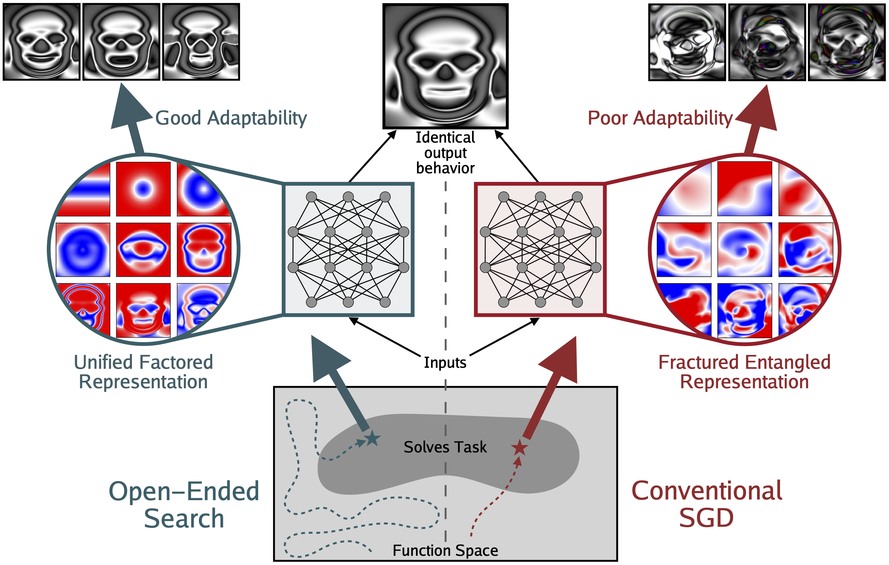
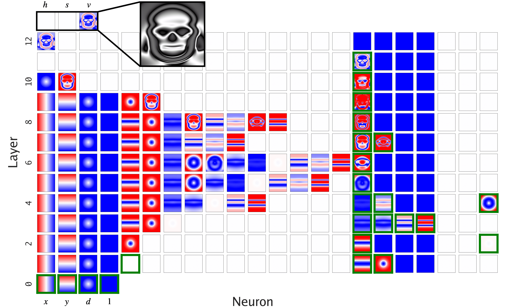
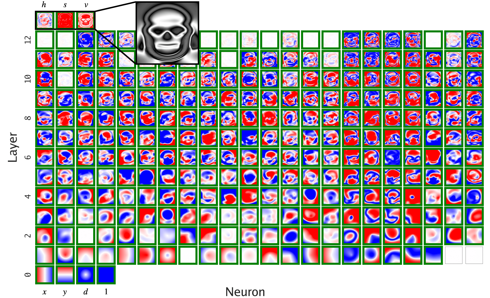
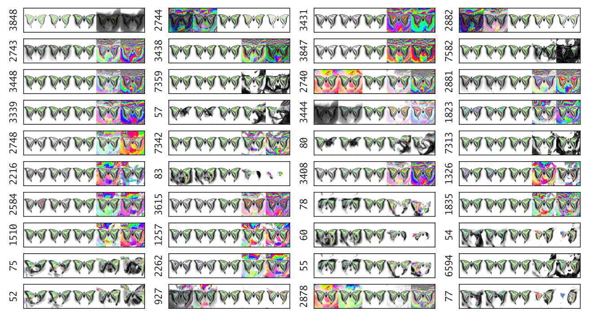
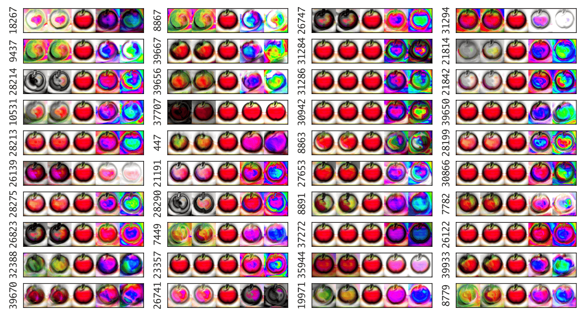
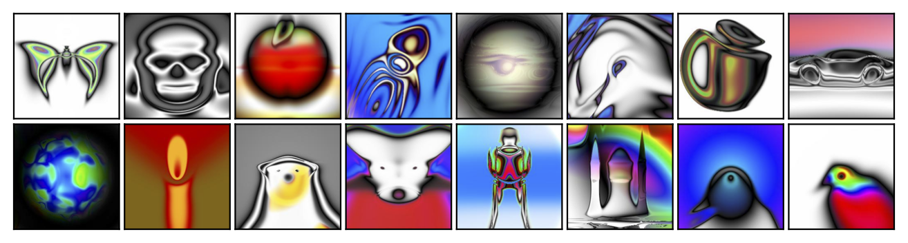

<h1 align="center">
  <a href="https://arxiv.org/abs/2505.11581">
    </a><br>
</h1>

<h1 align="center">
The Fractured Entangled Representation Hypothesis
</h1>
<p align="center">
  📝<a href="https://arxiv.org/abs/2505.11581">Paper PDF</a>
</p>
<p align="center">
<a href="https://colab.research.google.com/github/akarshkumar0101/fer/blob/master/src/fer.ipynb" target="_parent"></a>
</p>

<div align="center" style="line-height: 1.4;">
  <p style="font-size: 1.1em; margin: 0;">
    <a href="https://x.com/akarshkumar0101">Akarsh Kumar</a><sup>1</sup>,
    <a href="https://x.com/jeffclune">Jeff Clune</a><sup>2,3</sup>,
    <a href="https://x.com/joelbot3000">Joel Lehman</a><sup>4</sup>,
    <a href="https://x.com/kenneth0stanley">Kenneth O. Stanley</a><sup>5</sup>
    <br/>
    <span style="font-size: 0.95em;">
      <sup>1</sup>MIT, <sup>2</sup>University of British Columbia, <sup>3</sup>Vector Institute, 
      <sup>4</sup>University of Oxford, <sup>5</sup>Lila Sciences
    </span>
  </p>
</div>

<!-- [Akarsh Kumar](https://x.com/akarshkumar0101) $^{1}$, [Jeff Clune](https://x.com/jeffclune)  $^2$ $^{3}$, [Joel Lehman](https://x.com/joelbot3000) $^{4}$, [Kenneth O. Stanley](https://x.com/kenneth0stanley) $^5$
<br>
$^1$ MIT, $^2$ University of British Columbia, $^3$ Vector Institute, $^4$ University of Oxford, $^5$ Lila Sciences -->

## Abstract
Much of the excitement in modern AI is driven by the observation that scaling up existing systems leads to better performance.
But does better performance necessarily imply better internal representations?
While the representational optimist assumes it must, this position paper challenges that view.
We compare neural networks evolved through an open-ended search process to networks trained via conventional stochastic gradient descent (SGD) on the simple task of generating a single image.
This minimal setup offers a unique advantage: each hidden neuron's full functional behavior can be easily visualized as an image, thus revealing how the network's output behavior is internally constructed neuron by neuron.
The result is striking: while both networks produce the same output behavior, their internal representations differ dramatically.
The SGD-trained networks exhibit a form of disorganization that we term *fractured entangled representation* (FER).
Interestingly, the evolved networks largely lack FER, even approaching a *unified factored representation* (UFR).
In large models, FER may be degrading core model capacities like generalization, creativity, and (continual) learning.
Therefore, understanding and mitigating FER could be critical to the future of representation learning.

## More Data and Visualizations

<div style="text-align: center;">
  
  
  <br>
  
  
</div>


Here is the all of the supplementary data from the paper.

### Intermediate Feature Maps:
- Skull:
  - [Picbreeder Skull](./assets/fmaps_576_pb.pdf)
  - [SGD Skull](./assets/fmaps_576_sgd_pb.pdf)
  - [SGD (ReLU) Skull](./assets/fmaps_576_sgd_relu.pdf)
  - [SGD Skull (PCA Transformed)](./assets/fmaps_576_sgd_pb_pca.pdf)
- Butterfly:
  - [Picbreeder Butterfly](./assets/fmaps_4376_pb.pdf)
  - [SGD Butterfly](./assets/fmaps_4376_sgd_pb.pdf)
  - [SGD (ReLU) Butterfly](./assets/fmaps_4376_sgd_relu.pdf)
- Apple:
  - [Picbreeder Apple](./assets/fmaps_5736_pb.pdf)
  - [SGD Apple](./assets/fmaps_5736_sgd_pb.pdf)
  - [SGD (ReLU) Apple](./assets/fmaps_5736_sgd_relu.pdf)


### All Weight Sweeps:
- Skull:
  - [Picbreeder Skull](./assets/weight_sweeps_all_576_pb.pdf)
  - [SGD Skull](./assets/weight_sweeps_all_576_sgd_pb.pdf)
  - [SGD (ReLU) Skull](./assets/weight_sweeps_all_576_sgd_relu.pdf)
  - [Picbreeder Skull (Randomized Directions)](./assets/weight_sweeps_all_576_pb_random.pdf)
  - [SGD Skull (Randomized Directions)](./assets/weight_sweeps_all_576_sgd_pb_random.pdf)
- Butterfly:
  - [Picbreeder Butterfly](./assets/weight_sweeps_all_4376_pb.pdf)
  - [SGD Butterfly](./assets/weight_sweeps_all_4376_sgd_pb.pdf)
  - [SGD (ReLU) Butterfly](./assets/weight_sweeps_all_4376_sgd_relu.pdf)
- Apple
  - [Picbreeder Apple](./assets/weight_sweeps_all_5736_pb.pdf)
  - [SGD Apple](./assets/weight_sweeps_all_5736_sgd_pb.pdf)
  - [SGD (ReLU) Apple](./assets/weight_sweeps_all_5736_sgd_relu.pdf)

### Select Weight Sweeps From the Paper:
- Skull:
  - [Picbreeder Skull](./assets/weight_sweeps_576_pb.pdf)
  - [SGD Skull](./assets/weight_sweeps_576_sgd_pb.pdf)
  - [Picbreeder Skull (Randomized Directions)](./assets/weight_sweeps_576_pb_random.pdf)
  - [SGD Skull (Randomized Directions)](./assets/weight_sweeps_576_sgd_pb_random.pdf)
- Butterfly:
  - [Picbreeder Butterfly](./assets/weight_sweeps_4376_pb.pdf)
  - [SGD Butterfly](./assets/weight_sweeps_4376_sgd_pb.pdf)
- Apple
  - [Picbreeder Apple](./assets/weight_sweeps_5736_pb.pdf)
  - [SGD Apple](./assets/weight_sweeps_5736_sgd_pb.pdf)


### Other Assets
All other important assets from the paper can be found in [./assets/](./assets/).


## Code
This repo contains code to:
- Load the picbreeder genomes from the paper
- Layerize it into a MLP format
- Train a SGD network to mimic that output
- Visualize the internal representation
- Do weight sweeps and visualize the result


### Google Colab
For a quick start, open [src/fer.ipynb](src/fer.ipynb) in Google Colab: 

<a href="https://colab.research.google.com/github/akarshkumar0101/fer/blob/master/src/fer.ipynb" target="_parent"></a>

### Running Locally
To run this project locally, you can start by cloning this repo.
```sh
git clone https://github.com/akarshkumar0101/fer
```
Then, set up the python environment with conda:
```sh
conda create --name=fer python=3.10.16 --yes
conda activate fer
```

Now you can install these libraries.
The versioning needs to be very specific for the following.
However, if you don't need to train the SGD network to play around with the results; in that case you can simply install the cpu version of jax following [official guide](https://github.com/jax-ml/jax?tab=readme-ov-file#installation).
```sh
python -m pip install jax==0.4.28 jaxlib==0.4.28+cuda12.cudnn89 -f https://storage.googleapis.com/jax-releases/jax_cuda_releases.html --no-cache-dir
python -m pip install flax==0.10.2 evosax==0.1.6 orbax-checkpoint==0.11.0 optax==0.2.4 --no-deps
```

Then, install all the other necessary python libraries:
```sh
python -m pip install -r requirements.txt
```

Now you can run through the notebook [src/fer.ipynb](src/fer.ipynb) that quickly covers everything you need.
However, here are some additional details on the file structure:
- [./assets](./assets/) contains the additional data and all assets from the paper
- [./picbreeder_genomes/](./picbreeder_genomes/) contains the raw picbreeder genomes for the skull, butterfly, and apple
- [./data/](./data/) contains the data for the layerized picbreeder CPPN and the SGD CPPN, we have already precomputed this directory for you
- [./src/](./src/) contains the code
    - [./src/color.py](./src/color.py) is code to convert hsv to rgb
    - [./src/cppn.py](./src/cppn.py) the flax CPPN code to model MLPs with arbitrary activation functions at different neurons
    - [./src/process_pb.py](./src/process_pb.py) processes the picbreeder genome to create layerized CPPNs
    - [./src/train_sgd.py](./src/train_sgd.py) trains an SGD CPPN with a specified architecture on a target image
    - [./src/util.py](./src/util.py) and [./src/picbreeder_util.py](./src/picbreeder_util.py) contain some utility functions


### Contact
Please contact us at akarshkumar0101@gmail.com if you would like access to more Picbreeder genomes for research.

<div style="text-align: center;">
  
</div>

## Bibtex Citation
To cite our work, use the following:
```
@article{kumar2025fractured,
  title = {Questioning Representational Optimism in Deep Learning: The Fractured Entangled Representation Hypothesis},
  author = {Akarsh Kumar and Jeff Clune and Joel Lehman and Kenneth O. Stanley},
  year = {2025},
  url = {https://arxiv.org/abs/2505.11581}
}
```
